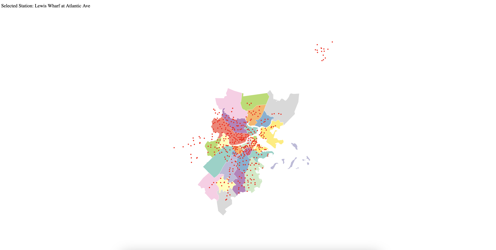

# Development log

Purpose of this file is to log the work and effort that went into developing the final product. This project requires a lot of learning for me, so I want to remember the steps it took to get me to the end.

This also serves as a place to credit resources that I used to create this project (and for me to reference them if I need them again in the future).

## 2/23/2023 - Data Collection

The goal of this project is initially to create an interactive map of Boston. Since Blue Bike stations span all across the greater Boston area I needed to create a map file that would represent the region. Through research, I learned the easiest way to do this would be using the geojson file format. However I quickly ran into obstacles when I could not easily find existing geoJSONs for Boston's neighboring cities. Enter the OpenStreetMaps API.

Following advice found in [this stackexchange post](https://gis.stackexchange.com/questions/183248/getting-polygon-boundaries-of-city-in-json-from-google-maps-api), it is possible to extract a geoJSON from OpenStreetMaps for any city that they have defined boundaries of. This made it very easy to collect geoJSONs.

## 2/24/2023 - Map Data Cleaning

After acquiring individual geoJSONs I needed to combine them into one large geoJSON for the greater Boston area. The online tool I found to do this, ([findthatpostcode.co.uk](https://findthatpostcode.uk/tools/merge-geojson)) only accepted geoJSONs that were of the type `FeatureCollection`, but OpenStreetMaps gives geoJSONs in the `GeometryCollection` format. It is actually a simple manual process to convert between the two types (allowed by the fact that OpenStreetMaps geoJSONs are very simple in structure). So I manually converted them to the desired format and created my combined file.

Using [this medium post](https://medium.com/@ivan.ha/using-d3-js-to-plot-an-interactive-map-34fbea76bd78) as a basis for my code and the help of ChatGPT to upgrade the code from `d3 v4` to `d3 v6` I was able to create a simple rendering of my greater Boston area geoJSON. The only problem was that some of the neighborhoods were inverted, resulting in the entire map being covered in a single color rather than just the neighborhood.

This problem had me stumped for quite some time. I entered my geoJSON into several online resources and it appeared to render correctly in all of them. I dug a little deeper and found out that d3 actually cares about the ordering of the coordinates, whereas standard geoJSON processors do not. To fix the issue it was as simple as reversing the coordinate ordering in the geoJSON, which I could accomplish using [this online tool](https://observablehq.com/@bumbeishvili/rewind-geojson).

I also acquired Blue Bike station data from the Blue Bike official website and added the information to the repository ([System data source](https://www.bluebikes.com/system-data)). I was then able to plot basic circles on the graph to represent the stations, and also add the station name to the page when one is highlighted.

This is what the map looks like after the culmination of all previous work mentioned: 

## 2/27/2023 - Reactive Reload and Code Splitting

I've come to realize that as this project grows it will become unsustainable to keep everything in `main.js`, so I am making my best effort in splitting the code into multiple files as much as possible. This is proving to be somewhat difficult to manage already because of the various event handlers and dependencies that need to be defined in particular orders. It has been fairly straightforward to move utility functions into their own files, but a lot of the data rendering and re-drawing will need to be better managed.

Something else I've been playing around with is re-rendering the visualizations. So far I've just test a simple re-rendering of the station circles sizes on zoom. I don't plan to use size of the mark as a channel to convey information to the viewer, so re-sizing the stations just makes the map more legible when a user zooms in. It works by using the `k` value provided from the `zoom` event. However, this value scales exponentially and grows larger as the user zooms further, so I created a simple function to take the multiplicative inverse to shrink the stations as the user zooms. This proved to be a fairly easy challenge to tackle, and sets up a nice paradigm for how re-rendering should be handled. I also added a debounce function that will hopefully be useful down the road as well.

My current idea for the final project is to have the map sticky on the right side of the screen as you scroll. There will be 2-3 different data visualizations on the right side that scroll into view. The map adjusts its appearance based on what visualization is currenlty most visible.

- Vis 1 would be of station usage throughout the months
- Vis 2 would be which stations see most usage between one another
- Vis 3 not sure yet

The hardest part of this might just be finding a way to cleanly transition the map between different states (through animation)
